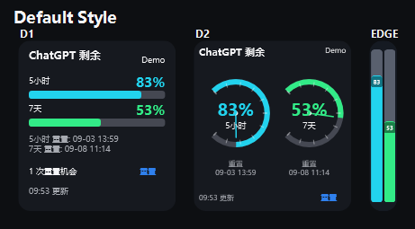
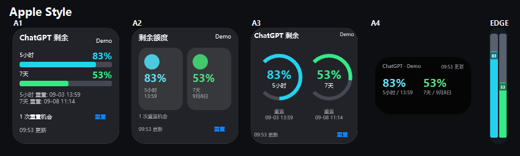
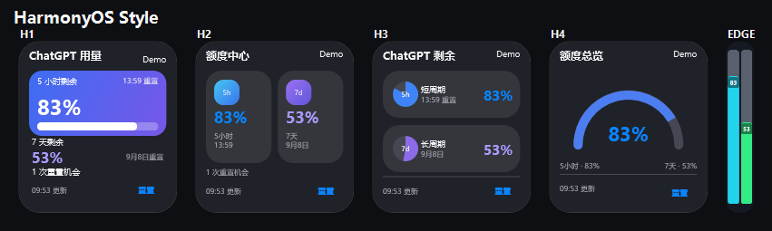
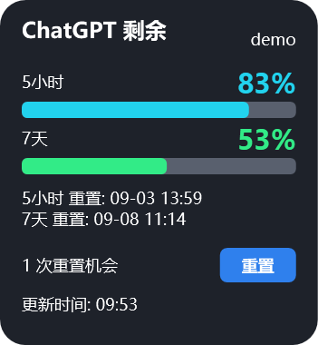
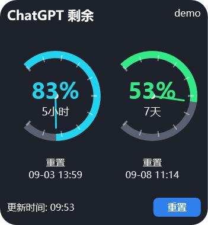

# ChatGPT/Codex 用量桌面组件

Windows 桌面悬浮组件，每 30 秒通过后台 `cmd` 命令调用本机 `codex app-server`，读取当前 Codex/ChatGPT 登录用户的用量百分比和重置日期。网络不通、未登录、未安装 Codex 或请求超时时显示 `-`。

## 界面预览

### 默认风格总览



包含双周期进度卡片、汽车双仪表和贴边双进度条。

### 苹果风格总览



包含 A1 桌面小组件、A2 控制中心、A3 健身双圆环、A4 黑色实时活动胶囊和贴边模式。

### 鸿蒙风格总览



包含 H1 服务卡片、H2 万能卡片宫格、H3 双状态饼图、H4 弧形总览和贴边模式。

## 单页截图

### 双周期进度卡片



### 汽车双仪表



### 贴边双进度条


组件尺寸为 175×190，额外高度用于容纳双仪表刻度、重置时间和按钮。

## 最新额度展示

组件不再假设账户只有一个额度。它会读取 `rateLimitsByLimitId`，并同时展示当前额度桶的两个真实周期，例如当前账户返回的 5 小时窗口和 7 天窗口：

- 完整卡片：两条独立的剩余量进度条、各自重置时间和可用完整重置次数。
- 重置机会单独占一行；扁平化“重置”按钮跳转到官方 Codex 用量面板 `https://chatgpt.com/codex/settings/usage`，由用户在网页中查看或操作重置。
- 圆环样式：采用汽车双仪表结构，左表显示短周期额度，右表显示长周期额度；两个仪表分别带刻度、动态指针、环形进度、剩余比例、状态颜色和重置时间。
- 双仪表页面底部也提供扁平化“重置”按钮，可直接打开官方 Codex 用量面板。
- 所有“重置”按钮提供悬停变色、按压缩放和透明度回弹反馈；动画结束后再打开网页。
- 贴边样式：并排显示两条竖向进度条；左侧表示短周期并使用青、黄、红状态色，右侧表示长周期并使用绿、黄、红状态色。

周期名称按服务端返回的 `windowDurationMins` 动态生成，不硬编码固定额度制度。

## 安装

双击 `ChatGPTUsageWidget-Setup.exe`。应用会立即启动，并添加到当前用户的开机启动项，不需要管理员权限。`install.cmd` 保留为开发调试安装方式。

配置文件位于 `%LOCALAPPDATA%\ChatGPTUsageWidget\config.json`。组件可拖动，右键可以刷新、切换界面风格、编辑配置、切换置顶或退出。

右键“风格”可以在三套外观之间即时切换，并自动保存选择。右键菜单使用圆角深色面板、圆润中文字体、柔和悬停高亮和清晰的选中标记：

- `1 默认`：保留原有进度卡片与汽车双仪表。
- `2 苹果`：A1 桌面小组件、A2 控制中心、A3 健身双圆环、A4 实时活动，共 4 张卡片；A4 仅显示黑色实时活动胶囊，外层保持透明。
- `3 鸿蒙`：H1 服务卡片、H2 万能卡片宫格、H3 双状态胶囊饼图、H4 弧形总览，共 4 张卡片。

三套风格都保留拖动贴边收起、双周期进度和重置按钮。单击组件会按当前风格的卡片顺序循环切换，并自动保存卡片位置。

右键“明暗模式”提供“跟随系统 / 浅色 / 深色”。默认跟随 Windows 应用主题，并每 2 秒检测主题变化；也可以手动固定为浅色或深色。菜单与卡片会同时切换配色，所有更新时间统一显示为“`09:53 更新`”。

鸿蒙 H3 的两个实心饼图和 H4 的真实弧线路径都根据剩余额度动态绘制。H4 的剩余与消耗区域使用平切边界，0% 时不会残留进度颜色；全部卡片的“重置”按钮统一为效果图中的蓝色文字型扁平按钮。

右键选择“字体颜色”可以自定义标题和普通信息文字颜色；剩余百分比继续按剩余额度显示绿色、黄色或红色。

单击组件可以在进度条卡片和圆环计数样式之间切换；拖动组件不会切换样式，当前样式会自动保存。

将组件拖到屏幕左边缘或右边缘会自动收起，保留短周期和长周期两条竖向剩余用量进度条；三套主题的贴边外框统一使用默认风格的圆角和边框。单击竖条临时恢复完整卡片，5 秒后自动回到贴边状态，拖离边缘会取消自动收起。

完整卡片和圆环样式会显示当前 Codex 登录用户名；未登录或账户读取失败时显示 `-`。

## 当前登录用户模式（默认）

无需配置密钥，使用 Codex CLI 已登录的当前 Windows 用户：

```json
{
  "mode": "codex"
}
```

## OpenAI API 费用模式（自动）

此模式查询官方 `/v1/organization/costs` 接口，显示本月费用占预算的比例。它是 OpenAI API 用量，不是 ChatGPT Plus/Pro 消息额度。

1. 设置当前 Windows 用户环境变量 `OPENAI_ADMIN_KEY`（必须是组织 Admin Key）。
2. 将配置改为：

```json
{
  "mode": "api-cost",
  "monthlyBudget": 20
}
```

密钥不会写入配置文件。卸载时双击 `uninstall.cmd`；它只移除开机启动项，不删除配置。
